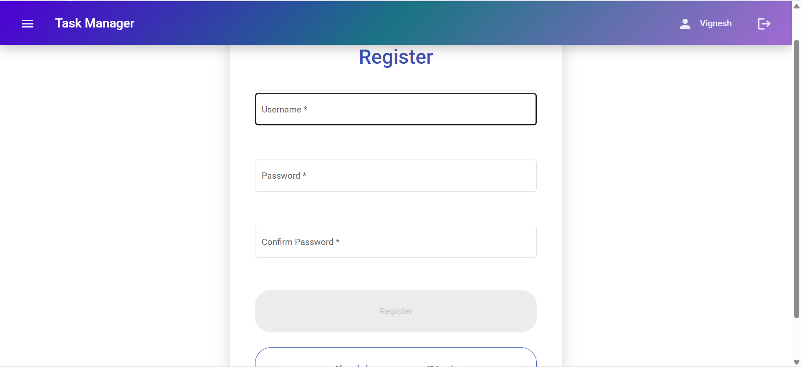
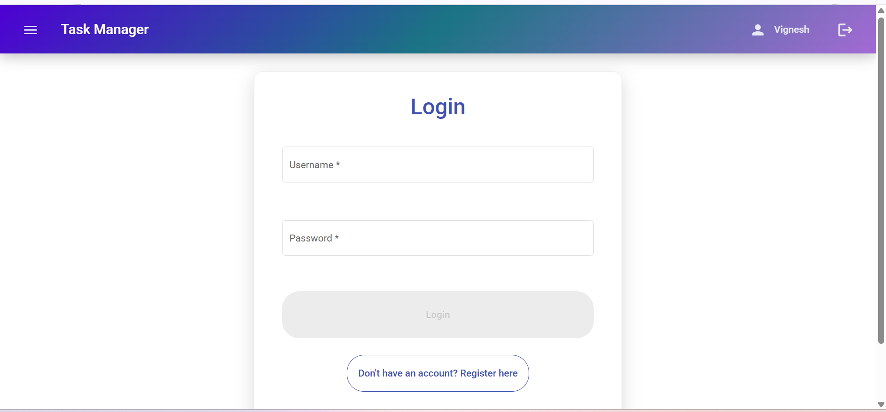
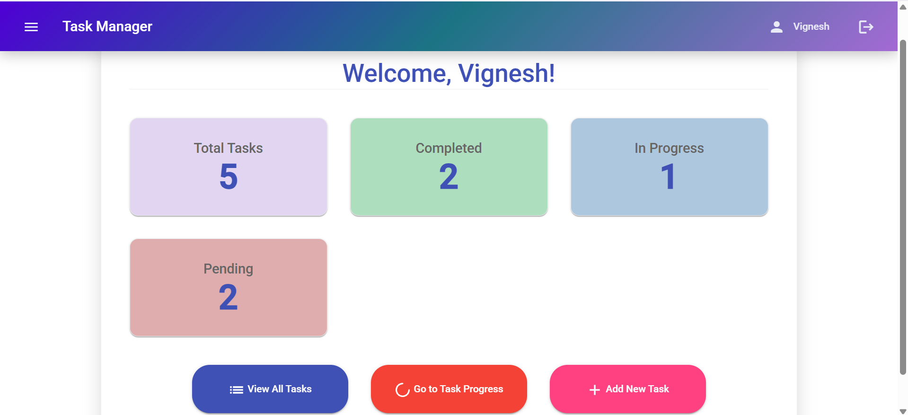
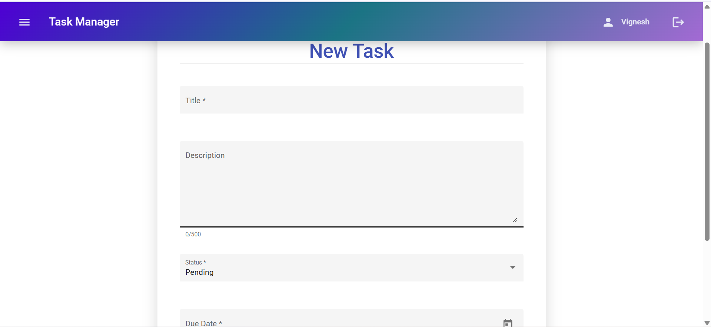
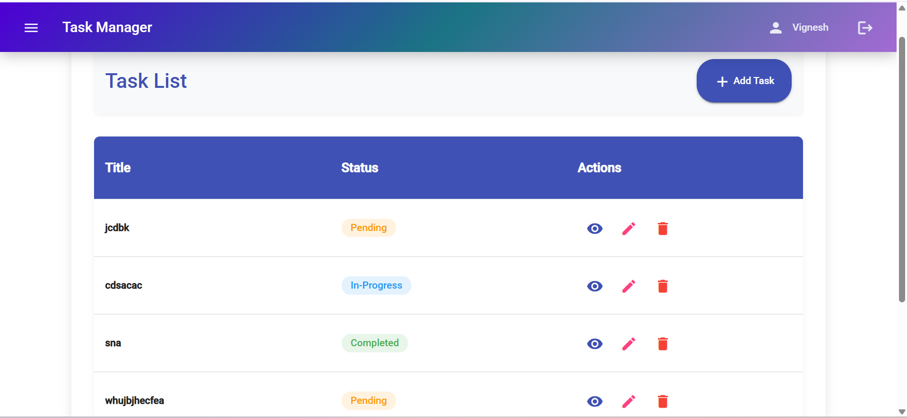
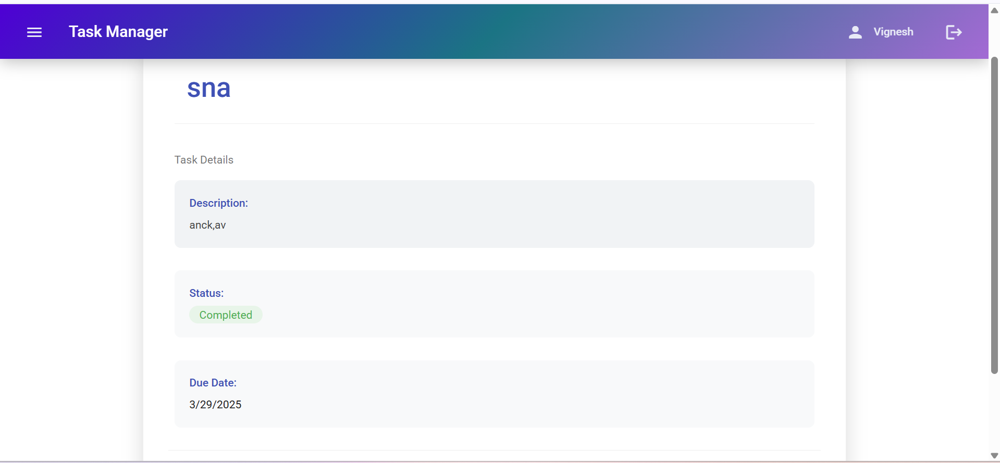
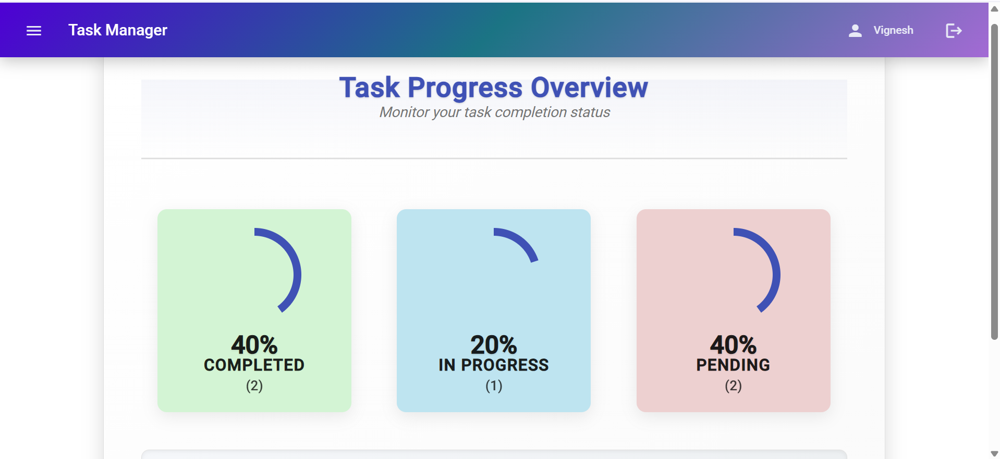

# Task Manager
This application is used to manage tasks efficiently.
<h3 align="center">Task Manager</h3>
<p align="center">
  <a href="https://vignesh-0521.github.io/Task-02-Task-Manager/">View Application Demo</a>
</p>

<details>
  <summary>Table of Contents</summary>
  <ol>
    <li>
      <a href="#description">Description</a>
      <ul>
        <li><a href="#features-of-the-application">Features of the Application</a></li>
        <li><a href="#application-demo">Application Demo</a></li>
      </ul>
    </li>
    <li>
      <a href="#getting-started">Getting Started</a>
      <ul>
        <li><a href="#prerequisites">Prerequisites</a></li>
        <li><a href="#development-server">Development Server</a></li>
      </ul>
    </li>
  </ol>
</details>

## Description
In this application, tasks are managed efficiently. New tasks can be added and existing tasks can be edited and updated. <br/>Users can view the task list and also can see the details for specific task. Tasks can be deleted. Users can see the task progress of completed, in-progress and pending tasks.<br/><br/> 
### Features of the application
- Users need to register and login to access the application.
- New tasks can be added and existing tasks can be edited and updated.
- Users can view the task list and details of the specfic task.
- Users are able to see the details of task like project name, description, due date and its status.
- Users are able to see the progress of the tasks like completed, in-progress and pending tasks.
- Tasks can be deleted.

### Application Demo

#### Register Page


#### Login Page


#### Dashboard Page


#### Add Task Page


#### Task List page


#### Task Detail Page


#### Task Progress Page


## Getting Started<br/>
This project was generated with [Angular CLI](https://github.com/angular/angular-cli) version 14.2.13. <br/>
### Prerequisites
The application can be forked or cloned into the local machine. Once forked or cloned, install the following dependencies by running:<br/>

* node 16
    ```sh
    npm install -g npm@16
    ```
* angular cli 14
    ```sh 
    npm install -g @angular/cli@14
    ```
* typescript 4.8.4
    ```sh
    npm install -g typescript@4.8.4
    ```
* rxjs 6.5.4
    ```sh
    npm install -g rxjs@6.5.4
    ```
* angular-material 14
    ```sh
    ng add @angular/material@14
    ```

### Development Server

Run `ng serve` for a dev server. Navigate to `http://localhost:4200/`. The application will automatically reload if you change any of the source files.
